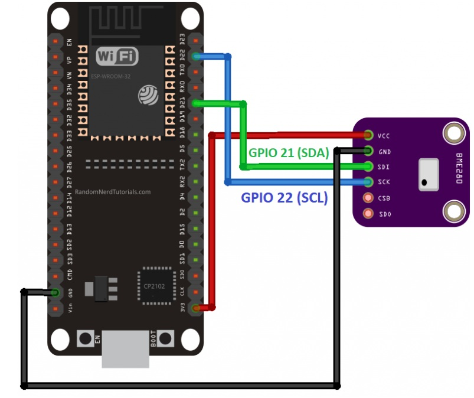

# ESP32 Boot Script with BME280 Sensor

## ESP32 to BME280 Sensor Connection :


---

## Microphython Code

```python
# This file is executed on every boot (including wake-boot from deepsleep)
#import esp
#esp.osdebug(None)
#import webrepl
#webrepl.start()

from machine import Pin, I2C
import bme280
import time

# Initialize I2C (ESP32 Default: SCL=Pin 22, SDA=Pin 21)
i2c = I2C(0, scl=Pin(22), sda=Pin(21), freq=100000)

def scan_i2c():
    devices = i2c.scan()
    if not devices:
        print("No I2C device found! Check your wiring.")
        return None
    else:
        print(f"I2C device(s) found at: {[hex(d) for d in devices]}")
        return devices

def read_sensor():
    try:
        # Address is usually 0x76 or 0x77
        sensor = bme280.BME280(i2c=i2c, address=0x76)
        
        while True:
            # The library returns a tuple: (temp, pressure, humidity)
            # Example format: ('23.50C', '1013.25hPa', '50.00%')
            reading = sensor.values
            
            print(f"Temp: {reading[0]} | Pressure: {reading[1]} | Humidity: {reading[2]}")
            time.sleep(2)
            
    except Exception as e:
        print(f"Error reading sensor: {e}")

# Check connection then start loop
if scan_i2c():
    read_sensor()
```

## Micropython Code Explanation
**1. Boot Setup** 
- The script runs automatically on every boot.
- Optional debugging (esp.osdebug) and WebREPL startup are commented out but can be enabled.

**2. I2C Initialization**
Uses ESP32 default pins:
- SCL → Pin 22
- SDA → Pin 21
- Frequency set to 100000 Hz.

**3. I2C Scan**
- i2c.scan() checks for connected devices.
- Prints device addresses in hex format.
- Warns if no devices are found.

**4. Sensor Reading**
- Initializes BME280 sensor (default address 0x76).
- Continuously reads:
    - Temperature
    - Pressure
    - Humidity
- Prints values every 2 seconds.

**5. Error Handling**
- Any exceptions during sensor read are caught and printed.

---

**Notes**
- Ensure correct wiring of SCL and SDA pins.
- BME280 address may vary (0x76 or 0x77).
- Use Ctrl+C in the REPL to stop the loop.
- Logs will show sensor readings in human-readable format.

Example Output
```bash
I2C device(s) found at: ['0x76']
Temp: 23.50C | Pressure: 1013.25hPa | Humidity: 50.00%
Temp: 23.52C | Pressure: 1013.20hPa | Humidity: 49.90%
```